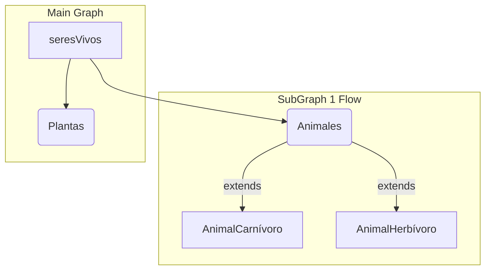

# abstract-class-methods :octocat:
## Clases Abractas

```mermaid
graph TB

  SubGraph1 --> SubGraph1Flow
  subgraph "SubGraph 1 Flow"
  SubGraph1Flow(Animales)
  SubGraph1Flow -- extends --> AnimalCarnívoro
  SubGraph1Flow -- extends --> AnimalHerbívoro
  end

  subgraph "Main Graph"
  SubGraph1[seresVivos]
  SubGraph1 --> FinalThing(Plantas)
end
```
